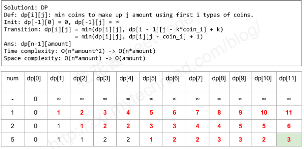

You are given coins of different denominations and a total amount of money amount. Write a function to compute the fewest number of coins that you need to make up that amount. If that amount of money cannot be made up by any combination of the coins, return -1.

#### Example1:
```
Input: coins = [1, 2, 5], amount = 11
Output: 3 
Explanation: 11 = 5 + 5 + 1
```

#### Example2:
```
Input: coins = [2], amount = 3
Output: -1
```

#### Note
```
You may assume that you have an infinite number of each kind of coin.
```

#### Solution

```
class Solution {
public:
    int coinChange(vector<int>& coins, int amount) {
        // dp[i] = min coins to make up to amount i
        vector<int> dp(amount+1, INT_MAX);
        dp[0]=0;
        for(int coin:coins){
            for(int i=coin;i<=amount;++i){
                if(dp[i-coin]!=INT_MAX){
                    dp[i]=min(dp[i], dp[i-coin]+1);
                }
            }
        }
        return dp[amount] == INT_MAX?-1:dp[amount];
    }
};
```
